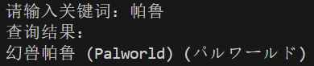

# pc-game-name-translations

English | [中文](README_CN.md)

This project aims to provide developers and players with a comprehensive database containing game names in English, Chinese, and Japanese, making it easier to find translations and variants of game names between different languages.

## Project Overview

The project contains two main files:

1. **game_names_merged.csv**: This file contains a database of over 25,000 game names, covering three languages: English, Chinese, and Japanese.

2. **find_similar_games.py**: This is a demonstration Python script that shows how to use the data in the `game_names_merged.csv` file to query game names and their translations.

## Usage

You can choose to directly download the `game_names_merged.csv` file, or clone the entire project locally.

**Run the demonstration script**:

   ```
   python find_similar_games.py
   ```


## Contributions

If you would like to contribute to the project by adding new game names or translations, please create a pull request containing your changes.