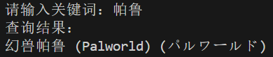

# pc-game-name-translations

[English](README.md) | 中文

本项目旨在为开发者和玩家提供一个包含英文、中文和日文游戏名称的综合数据库，以便更容易地查找不同语言之间的游戏名称翻译和变体。

## 项目概述

项目包含两个主要文件：

1. **game_names_merged.csv**：该文件包含了超过25,000个游戏名称的数据库，涵盖英文、中文和日文三种语言。

2. **find_similar_games.py**：这是一个用来演示的Python脚本，展示了如何使用`game_names_merged.csv`文件中的数据查询游戏名称及其翻译。

## 使用方法

你可以选择直接下载`game_names_merged.csv`文件，或者将整个项目克隆到本地。

**运行演示脚本**：

   ```
   python find_similar_games.py
   ```


## 贡献

如果您希望通过添加新游戏名称或翻译来为项目做出贡献，请创建一个包含您更改的拉取请求。